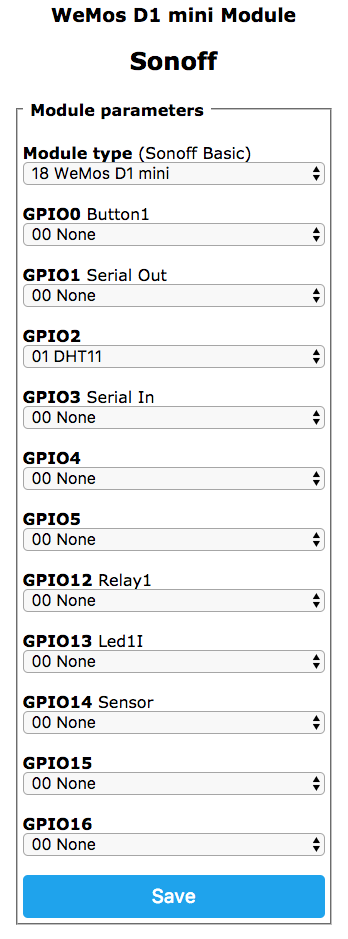
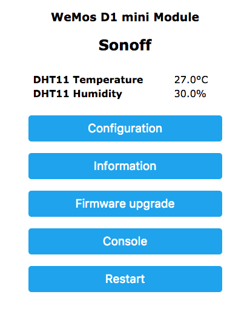

# Tasmota on WEMOS

Install Tasmota software on a WEMOS D1 mini (pro) with PlatformIO.

I assume you are familiar with the [Sonoff-Tasmota software](https://github.com/arendst/Sonoff-Tasmota) by Theo Arends. To get started do read the [Sonoff-Tasmota wiki pages](https://github.com/arendst/Sonoff-Tasmota/wiki).
This page is merely to help those who are trying to get the Sonoff-Tasmota running on a WeMos D1 min (pro) board.

## Requirements:
  - Serial drivers installed for your [WeMos board](https://www.wemos.cc/tutorial/get-started-arduino.html).
  - [PlatformIO](http://platformio.org/get-started/) installed.
  - Latest version of [Sonoff-Tasmota "Source code (zip)"](https://github.com/arendst/Sonoff-Tasmota/releases) downloaded and extracted.

## Software Versions
  - Sonoff-Tasmota v5.1.3
  - PlatformIO v2.0.0-beta3

## WeMos Hardware used
  - WeMos D1 mini v2.1.0
  - WeMos D1 mini Pro v1.0.0
  - WeMos DHT11 Shield
  - WeMos Relay Shield
  - WeMos 1-Button Shield v2.0.0

I tested the Tasmota software with the DHT11-, Relay- and Button-shield but these are optional.

## PlatformIO

Load the Sonoff-Tasmota base folder, including platformio.ini in PlatformIO.

### Changes via the PlatformIO Home page:
  - Platforms: Install the platform "Espressif 8266".

### Changes in the file platformio:ini

In platformio.ini we are going to add a new environment section and set the default environment to the newly created section.

First we create the new environment section.
  - Copy the first environment section named "sonoff".
  - Paste the section at the bottom of the file.
  - Name the new section "wemos-d1-mini".
  - Change the board type from esp01_1m to d1_mini.

The section should look like the following:

```
; WeMos (ESP8266 based)
[env:wemos-d1-mini]
platform = espressif8266
framework = arduino
board = d1_mini
board_flash_mode = qio
build_flags = -Wl,-Tesp8266.flash.1m0.ld -DMQTT_MAX_PACKET_SIZE=512
lib_deps = PubSubClient, NeoPixelBus, IRremoteESP8266, ArduinoJSON
```

The next step is to set the default environment to our newly created environment. In the [platformio] add the following line:

```
env_default = wemos-d1-mini
```

Your platformio.ini should look like this:

```
; PlatformIO Project Configuration File
;
;   Build options: build flags, source filter, extra scripting
;   Upload options: custom port, speed and extra flags
;   Library options: dependencies, extra library storages
;
; Please visit documentation for the other options and examples
; http://docs.platformio.org/en/stable/projectconf.html

[platformio]
src_dir = sonoff
env_default = wemos-d1-mini

; Sonoff et al (ESP8266 based)
[env:sonoff]
platform = espressif8266
framework = arduino
board = esp01_1m
board_flash_mode = qio
build_flags = -Wl,-Tesp8266.flash.1m0.ld -DMQTT_MAX_PACKET_SIZE=512
lib_deps = PubSubClient, NeoPixelBus, IRremoteESP8266, ArduinoJSON

; Sonoff Touch and Sonoff 4CH (ESP8285 based)
[env:sonoff-touch-4ch]
platform = espressif8266
framework = arduino
board = esp01_1m
board_flash_mode = dout
build_flags = -Wl,-Tesp8266.flash.1m0.ld -DMQTT_MAX_PACKET_SIZE=512
lib_deps = PubSubClient, NeoPixelBus, IRremoteESP8266, ArduinoJSON

; WeMos (ESP8266 based)
[env:wemos-d1-mini]
platform = espressif8266
framework = arduino
board = d1_mini
board_flash_mode = qio
build_flags = -Wl,-Tesp8266.flash.1m0.ld -DMQTT_MAX_PACKET_SIZE=512
lib_deps = PubSubClient, NeoPixelBus, IRremoteESP8266, ArduinoJSON
```

### Change the user_config.h

Change the user_config.h to match your situation:
  - Set the WiFi SSID and WiFi password
  - Set the MQTT Username and MQTT password or disable MQTT

### Build and Upload the firmware

Build and run the software. Make sure there are no errors in compiling and uploading.

## Configure the Tasmota software

You can use a tool like fing or your wireless router to find the IP-address of your WeMos device.

Open a browser and go to the IP-address of your WeMos device. You should be greeted with the familiar Tasmota configuration screen.

Set the device to "WeMos D1 mini" in the Configuration and save the configuration.
The device will reset, just wait for it to return.

I added the DHT11 shield to my WeMos, to configure it we return to the Configuration screen.

Set GPIO2 to DHT11 like below:



On the shield the DHT11 is connected to D4, this is connected to the GPIO2 on the ESP8266.

| WeMos Pin | Function | ESP-8266 Pin |
| --- | --- | --- |
| TX | TXD | TXD |
| RX | RXD | RXD |
| A0 | Analog input, max 3.3V input | A0 |
| D0 | IO | GPIO16 |
| D1 | IO, SCL | GPIO5 |
| D2 | IO, SDA | GPIO4 |
| D3 | IO, 10k Pull-up | GPIO0 |
| D4 | IO, 10k Pull-up, BUILTIN_LED | GPIO2 |
| D5 | IO, SCK | GPIO14 |
| D6 | IO, MISO | GPIO12 |
| D7 | IO, MOSI | GPIO13 |
| D8 | IO, 10k Pull-down, SS | GPIO15 |
| G | Ground | GND |
| 5V | 5V	 | - |
| 3V3 | 3.3V | 3.3V |
| RST | Reset | RST |

After saving the configuration and the required reset we should see the following screen:


